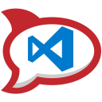

# Rocket.Code

This Extension lets you post to Rocket.Chat from within Visual Studio Code. It supports channels and private messages, as well as posting code snippets.

The Extension loads when you call the "Rocket.Code login" command from the palette.

## Features

* Post code snippets directly to a #channel or user
* Chat from within the Code interface, no need for an external client (for the channel(s) you join in the current workspace)

## Requirements

Visual Studio Code (obviously).

## Extension Settings

This extension contributes the following settings:

* `rocketCode.serverUrl`: The URL of the Rocket.Chat server, e.g. https://rocket.example.com
* `rocketCode.username`: Your Rocket.Chat username
* `rocketCode.password`: Your Rocket.Chat password
* `rocketCode.channel`: The default channel to post to (you can post to a different #channel/@DM at any time)

### Using Environment Variables and/or the workspace

You can connect to different Rocket.Chat servers for various projects, simply put the `rocketCode` settings in your workspace settings. This way, you can connect to your work server when on a work project, and a private server for a private project.

You can also set your Rocket.Chat credentials using environment variables:

* ROCKET_SERVER
* ROCKET_USER
* ROCKET_PASSWORD

The order of precedence is:

1. Workspace settings
1. User settings
1. Environment variables

You can also use a utility such as `direnv`, which you can get here: [https://github.com/direnv/direnv](https://github.com/direnv/direnv)

This allows you to set the ROCKET_* environment variables per directory, and gives you the best of both worlds.

## Known Issues

* Not all features are implemented yet...
* Needs tests...

## Release Notes

Please see the CHANGELOG
